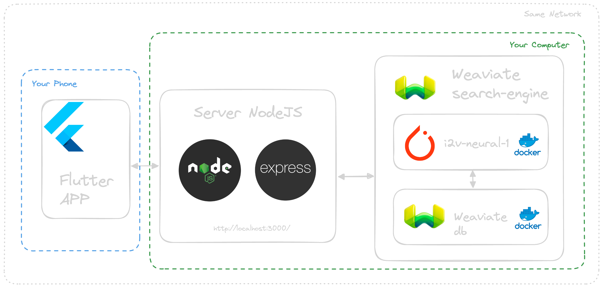

# Xployee - LambdaClass Employee Search Engine

## What is _Xployee_?

This is a Flutter application that returns the closest LambdaClass employee to the photo you select.

This is an image search engine that uses a vector database, [Weaviate](https://weaviate.io/), which is powered by a deep neural network. This database is pre-trained and we train it with photos of LambdaClass employees.

You can check its behavior in this [video](https://www.youtube.com/shorts/d_Hh2Sf4ZPg).

## Architecture



## Requirements

You need to have installed [Flutter](https://docs.flutter.dev/get-started/install), [NodeJS](https://nodejs.org/en/download) and [Docker](https://www.docker.com/products/docker-desktop/) in order to run this project.

You also need to have your phone and your computer connected to the same network.

## Run the project

### Run Weaviate (Docker)

```bash
cd search-engine
docker-compose up -d
```

### Run the server

#### Install dependencies
```bash
cd search-engine
npm install
```

#### Run the NodeJS App

```bash
cd search-engine
node index.js
```

### Run the mobile app

#### Setup the frontend

You need to create an `.env` file in the `flutter_app` directory. With this content:
```txt
BASE_ENDPOINT=http://192.168.0.22:3000
SERVER_IP=192.168.0.22
```
You have to replace the IP with the IP of your computer in your network. To find out, you can run this command:
```sh
ipconfig getifaddr en0
```

#### Run the Flutter app

```sh
flutter run
```
